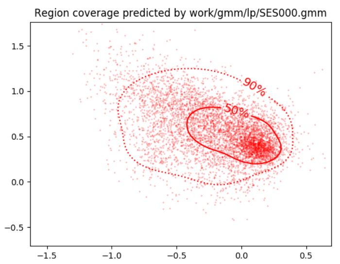
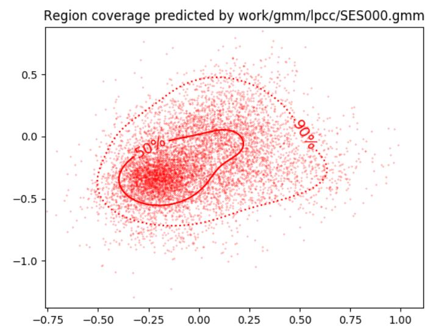
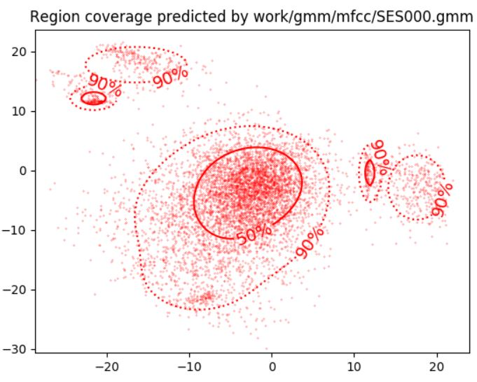
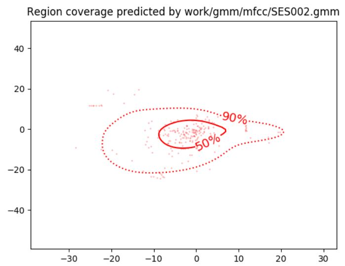
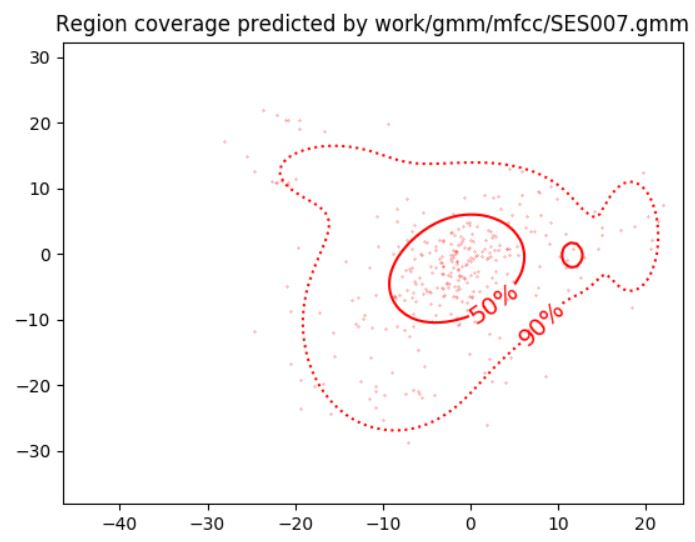
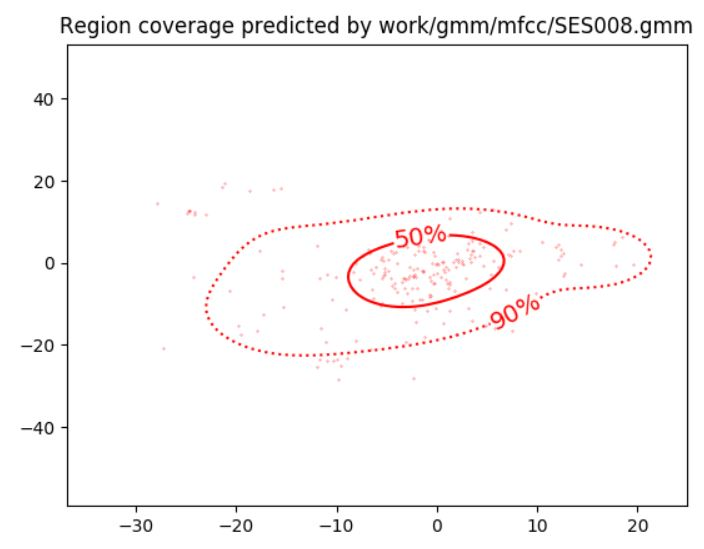

PAV - P4: reconocimiento y verificación del locutor
===================================================

Obtenga su copia del repositorio de la práctica accediendo a [Práctica 4](https://github.com/albino-pav/P4)
y pulsando sobre el botón `Fork` situado en la esquina superior derecha. A continuación, siga las
instrucciones de la [Práctica 3](https://github.com/albino-pav/P3) para crear una rama con el apellido de
los integrantes del grupo de prácticas, dar de alta al resto de integrantes como colaboradores del proyecto
y crear la copias locales del repositorio.

También debe descomprimir, en el directorio `PAV/P4`, el fichero [db_spk.tgz](https://atenea.upc.edu/pluginfile.php/3008277/mod_assign/introattachment/0/db_spk.tgz?forcedownload=1)
con la base de datos oral que se utilizará en la parte experimental de la práctica.

Como entrega deberá realizar un *pull request* con el contenido de su copia del repositorio. Recuerde
que los ficheros entregados deberán estar en condiciones de ser ejecutados con sólo ejecutar:

~~~~~~~~~~~~~~~~~~~~~~~~~~~~~~~~~~~~~~~~~~~~~~~~~~~~~.sh
  make release
  run_spkid mfcc train test classerr verify verifyerr
~~~~~~~~~~~~~~~~~~~~~~~~~~~~~~~~~~~~~~~~~~~~~~~~~~~~~

A modo de memoria de la práctica, complete, en este mismo documento y usando el formato *markdown*, los
ejercicios indicados.

## Ejercicios.

### Extracción de características.

- Escriba el *pipeline* principal usado para calcular los coeficientes cepstrales de predicción lineal
  (LPCC), en su fichero <code>scripts/wav2lpcc.sh</code>:

~~~~~~~~~~~~~~~~~~~~~~~~~~~~~~~~~~~~~~~~~~~~~~~~~~~~~~~~~~~~~~~~~~~~~~~~~~~~~~~~~~~~~~~~~~~~~~~~~.sh
# Main command for feature extration
sox $inputfile -t raw - dither -p12 | $X2X +sf | $FRAME -l 400 -p 80 | $WINDOW -l 400 -L 512 |
	$LPC -l 400 -m $lpc_order| $LPC2C -m $lpc_order -M $cepstrum_order > $base.lpcc
~~~~~~~~~~~~~~~~~~~~~~~~~~~~~~~~~~~~~~~~~~~~~~~~~~~~~~~~~~~~~~~~~~~~~~~~~~~~~~~~~~~~~~~~~~~~~~~~~

- Escriba el *pipeline* principal usado para calcular los coeficientes cepstrales en escala Mel (MFCC), en
  su fichero <code>scripts/wav2mfcc.sh</code>:

~~~~~~~~~~~~~~~~~~~~~~~~~~~~~~~~~~~~~~~~~~~~~~~~~~~~~~~~~~~~~~~~~~~~~~~~~~~~~~~~~~~~~~~~~~~~~~~~~.sh
# Main command for feature extration
sox $inputfile -t raw - dither -p12 | $X2X +sf | $FRAME -l 400 -p 80 |\
	$MFCC -l 400 -m $mfcc_order -n $mfcc_numfilters -E > $base.mfcc
~~~~~~~~~~~~~~~~~~~~~~~~~~~~~~~~~~~~~~~~~~~~~~~~~~~~~~~~~~~~~~~~~~~~~~~~~~~~~~~~~~~~~~~~~~~~~~~~~

- Indique qué parámetros considera adecuados para el cálculo de los coeficientes LPCC y MFCC.

~~~~~~~~~~~~~~~~~~~~~~~~~~~~~~~~~~~~~~~~~~~~~~~~~~~~~~~~~~~~~~~~~~~~~~~~~~~~~~~~~~~~~~~~~~~~~~~~~.sh
LPCC
Orden del LPC: 8
Orden del CEPSTRUM: 13

MFCC
Coeficientes de Mel-Cepstrum: 16
Número de filtros: 24
~~~~~~~~~~~~~~~~~~~~~~~~~~~~~~~~~~~~~~~~~~~~~~~~~~~~~~~~~~~~~~~~~~~~~~~~~~~~~~~~~~~~~~~~~~~~~~~~~

- Inserte una imagen mostrando la dependencia entre los coeficientes 2 y 3 de las tres parametrizaciones
  para una señal de prueba.
  
  LP

  

  LPCC

  

  MFCC

  

  + ¿Cuál de ellas le parece que contiene más información?

  La parametrización por coeficientes cepstrales de Mel guarda mayores dependencias entre los 
  coeficientes 2 y 3. Tal es así que hay 5 valores habituales entre ambos, como podemos ver en la imagen. 

- Usando el programa <code>pearson</code>, obtenga los coeficientes de correlación normalizada entre los
  parámetros 2 y 3, y rellene la tabla siguiente con los valores obtenidos.

  |                        |   LP   |  LPCC  |  MFCC  |
  |------------------------|:------:|:------:|:------:|
  | &rho;x[2,3] | -0.487 | 0.3139 | -0.021 |
  

  + Compare los resultados de <code>pearson</code> con los obtenidos gráficamente.

  Pearson ha calculado los coeficientes de correlación entre los parámetros 2 y 3, y para MFCC éstos son 
  mucho más cercanos a 0 que lo demás, lo cual reafirma la observación anterior. La correlación es mayor
  entorno al lag 0.

  
### Entrenamiento y visualización de los GMM.

- Inserte una gráfica que muestre la función de densidad de probabilidad modelada por el GMM de un locutor
  para sus dos primeros coeficientes de MFCC.

  
- Inserte una gráfica que permita comparar los modelos y poblaciones de dos locutores distintos. Comente el
  resultado obtenido y discuta si el modelado mediante GMM permite diferenciar las señales de uno y otro.

  Para este apartado se han usado los locutores 2 y 7, ya que aparecen en la lista de users y garantiza que 
  son dos personas distintas.

### Reconocimiento del locutor.

- Inserte una tabla con la tasa de error obtenida en el reconocimiento de los locutores de la base de datos
  SPEECON usando su mejor sistema de reconocimiento para los parámetros LP, LPCC y MFCC.

  |            |   LP   |  LPCC  |  MFCC  |
  |------------|:------:|:------:|:------:|
  | Error rate |  4.46% |  6.15% | 42.55% |

### Verificación del locutor.

- Inserte una tabla con el *score* obtenido con su mejor sistema de verificación del locutor en la tarea
  de verificación de SPEECON. La tabla debe incluir el umbral óptimo, el número de falsas alarmas y de
  pérdidas, y el score obtenido usando la parametrización que mejor resultado le hubiera dado en la tarea
  de reconocimiento.

  |                 |    LP   |   LPCC  |   MFCC  |
  |-----------------|:-------:|:-------:|:-------:|
  | Umbral          |  1.213  |  1.412  |  2.487  |
  | Falsas alarmas  |  0/1000 |  0/1000 |  0/1000 |
  | Pérdidas        | 197/250 | 169/250 | 169/250 |
  | Score           |   78.8  |   67.6  |   96.4  |
  

### Test final y trabajo de ampliación.

- Recuerde adjuntar los ficheros `class_test.log` y `verif_test.log` correspondientes a la evaluación
  *ciega* final.

- Recuerde, también, enviar a Atenea un fichero en formato zip o tgz con la memoria con el trabajo
  realizado como ampliación, así como los ficheros `class_ampl.log` y/o `verif_ampl.log`, obtenidos como
  resultado del mismo.
